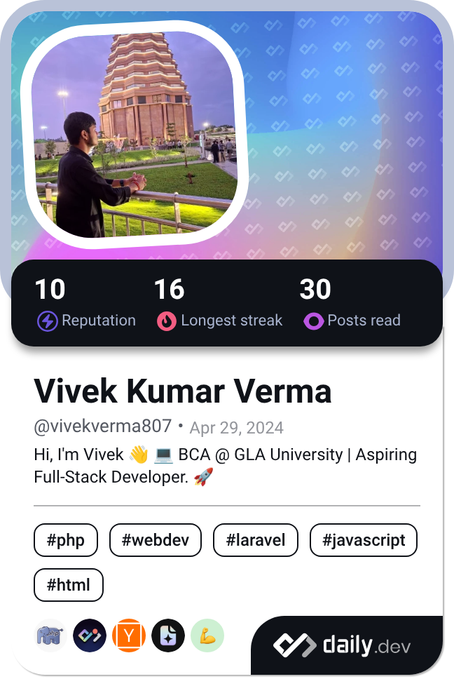
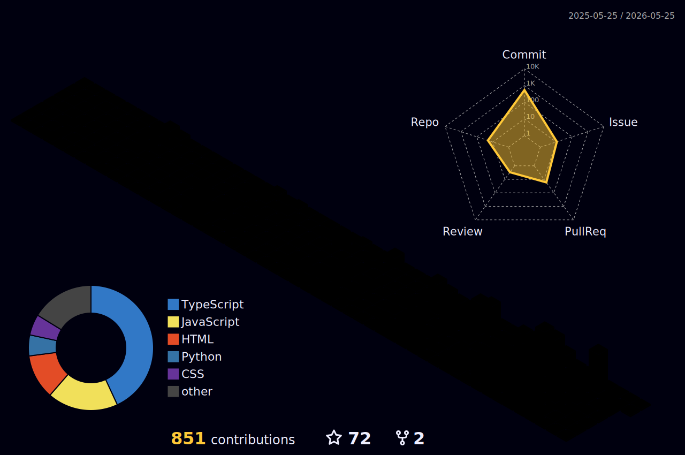

<!-- Header Banner -->
<div align="center">
  
</div>

<br clear="both">

<div align="center">
  
</div>

<!-- About Me Section -->
## 👨‍💻 About Me

```python
class Developer:
    def __init__(self):
        self.name = "Vivek Kumar Verma"
        self.location = "Mathura, UP IN"
        self.role = "Full Stack Developer"
        self.education = "BCA Student"
        
    def get_skills(self):
        return {
            "languages": ["Python", "JavaScript", "HTML", "CSS"],
            "frameworks": ["React", "Node.js", "Streamlit"],
            "databases": ["MongoDB", "MySQL", "PostgreSQL"],
            "specialties": ["Web Dev", "E-commerce", "AI/ML", "API Integration"]
        }
    
    def current_projects(self):
        return [
            "🛒 Jewelry E-commerce Platform",
            "🏥 Healthcare Mediator System",
            "📊 Real-time Admin Dashboards",
            "📚 Preparing for NIMCET & CUET PG"
        ]
    
    def philosophy(self):
        return "Code is poetry, bugs are just plot twists �"
    
    def life_status(self):
        return {
            "coding": "50%",
            "learning": "30%",
            "business": "15%",
            "chai": "5%",
            "sleep": "Error 404: Not Found"
        }

me = Developer()
print(f"👋 Hi, I'm {me.name}")
print(f"💻 {me.role} | 🎓 {me.education}")
```

<br>

<div align="center">
  
</div>

## 🌐 Connect With Me

<div align="center">
<table border="0" width="85%">
    <tr>
        <td width="45%" align="left" valign="middle">
            <a href="https://github.com/vivekverma807" target="_blank">
                
            </a><br>
            <a href="https://linkedin.com/in/vivekverma807" target="_blank">
                
            </a><br>
            <a href="https://twitter.com/vivekverma807" target="_blank">
                
            </a><br>
            <a href="https://instagram.com/vivekverma807" target="_blank">
                
            </a><br>
            <a href="https://discord.com/users/vivekverma807" target="_blank">
                
            </a><br>
            <a href="https://stackoverflow.com/users/vivekverma807" target="_blank">
                
            </a><br>
            <a href="https://leetcode.com/vivekverma807" target="_blank">
                
            </a><br>
            <a href="https://codepen.io/vivekverma807" target="_blank">
                
            </a><br>
            <a href="https://dev.to/vivekverma807" target="_blank">
                
            </a><br>
            <a href="https://medium.com/@vivekverma807" target="_blank">
                
            </a><br>
            <a href="https://hackerrank.com/vivekverma807" target="_blank">
                
            </a>
        </td>
        <td width="55%" align="right" valign="middle">
            <a href="https://app.daily.dev/vivekverma807">
                
            </a>
        </td>
    </tr>
</table>
</div>

<br>

<div align="center">
  
</div>

<br>

<!-- Pacman Contribution Graph -->
<div align="center">
  <picture>
    <source media="(prefers-color-scheme: dark)" srcset="https://raw.githubusercontent.com/vivekverma807/vivekverma807/output/pacman-contribution-graph-dark.svg">
    <source media="(prefers-color-scheme: light)" srcset="https://raw.githubusercontent.com/vivekverma807/vivekverma807/output/pacman-contribution-graph.svg">
    
  </picture>
</div>

<br>

<div align="center">
  
</div>

## �🛠️ Tech Stack & Skills

<!-- Octocat Mascot -->
<div align="center">
  
</div>

<br>

### 🎨 Frontend Development
<div align="center">
  
[](https://skillicons.dev)

</div>

### ⚙️ Backend Development
<div align="center">
  
[](https://skillicons.dev)

</div>

### 🗄️ Database & Storage
<div align="center">
  
[](https://skillicons.dev)

</div>

### 🚀 DevOps & CI/CD
<div align="center">
  
[](https://skillicons.dev)

</div>

### 🔧 Tools & Technologies
<div align="center">
  
[](https://skillicons.dev)

</div>

### 📱 Mobile & Cross-Platform
<div align="center">
  
[](https://skillicons.dev)

</div>

### 🤖 AI/ML & Data Science
<div align="center">
  
[](https://skillicons.dev)

</div>

### 💻 Programming Languages
<div align="center">
  
[](https://skillicons.dev)

</div>

<br>

<div align="center">
  
</div>

## 📊 GitHub Statistics

<div align="center">


### 🔥 Streak Stats
<p align="center">

</p>

<!-- GitHub Profile Summary Cards -->
<p align="center">
  
</p>

<p align="center">
  
  
</p>

<p align="center">
  
  
</p>

</div>

<br>

<div align="center">
  
</div>

## 📉 Contribution Graph

<div align="center">


</div>

<br>

<div align="center">
  
</div>

## 🎨 3D Contribution Graph

<div align="center">



</div>

<br>

<div align="center">
  
</div>

## ✍️ Random Dev Quote

<div align="center">


</div>

<br>

<div align="center">
  
</div>

## 🔝 Top Contributed Repositories

<div align="center">


</div>

<br>

<div align="center">
  
</div>

## 👀 Profile Views

<div align="center">


</div>

<br>

<div align="center">
  
</div>

## 🐍 Snake Eating My Contributions

<div align="center">
  <picture>
    <source media="(prefers-color-scheme: dark)" srcset="https://raw.githubusercontent.com/vivekverma807/vivekverma807/output/snake-dark.svg">
    <source media="(prefers-color-scheme: light)" srcset="https://raw.githubusercontent.com/vivekverma807/vivekverma807/output/snake.svg">
    
  </picture>
</div>

<br>

<div align="center">
  
</div>

<br>

<!-- Footer Wave -->
<div align="center">
  
</div>
